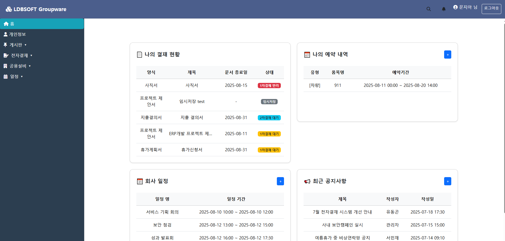
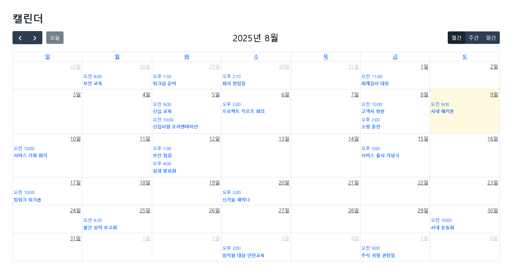
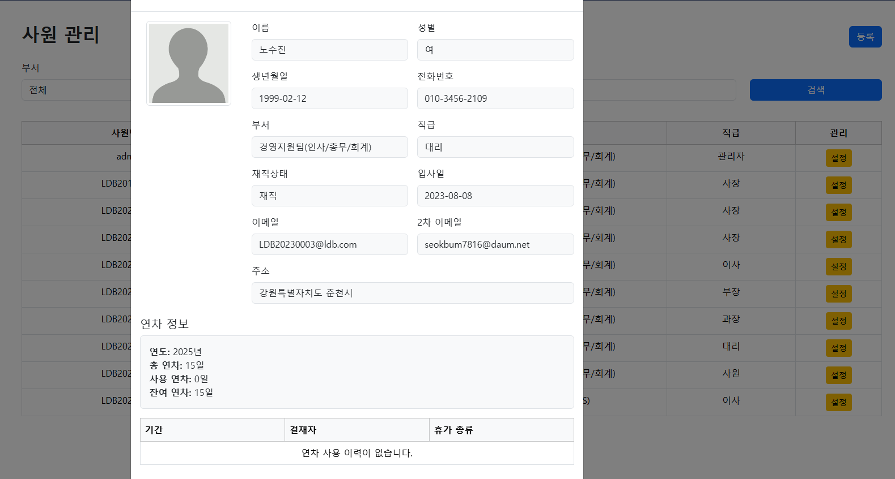

# 🌐 LDBSOFT Groupware

기업 내 업무 전반을 통합 관리할 수 있도록 설계된 **웹 기반 그룹웨어 시스템**입니다.  
전자결재, 일정관리, 연차관리, 게시판, 설비예약, 관리자 기능 등 다양한 모듈로 구성되어 있으며, 실무를 반영한 설계와 실제 배포 환경까지 구현한 프로젝트입니다.

---

## 📌 배포 주소

- ▶️ **http://3.34.2.242:8080/** (AWS EC2 기반 서버 실시간 접속 가능)
- 예시 계정:
  - 일반 직원: `LDB20170001 / 1234`
  - 결재자: `LDB20170001 / 1234`
  - 관리자: `admin / 1234`

---

## 🖼️ 주요 화면

| 메인화면 | 전자결재 작성 | 받은 결재 문서 |
|----------|---------------|----------------|
|  |  |  |

| 연차 대시보드 | 캘린더 | 사원 관리 |
|----------------|------------------|------------|
|  |  |  |

| 부서 권한 설정 | 공통 코드 관리 | 비밀번호 찾기 |
|----------------|------------------|----------------|
|  |  |  |


---

## 🛠 기술 스택

| 구분 | 기술 |
|------|------|
| Language | Java 21 |
| Framework | Spring Boot 3.5.3 (MVC) |
| ORM | MyBatis |
| View | JSP + JSTL + SiteMesh |
| UI | Bootstrap 5, FontAwesome |
| DB | MariaDB |
| Build | Maven |
| Deploy | AWS EC2 (Ubuntu), Nginx 예정 |

---

## 🧰 개발 도구

- **IDE**: IntelliJ IDEA
- **DB Client**: HeidiSQL
- **Git**: Fork (Git GUI)
- **형상관리**: GitHub

---

## 🗓️ 프로젝트 일정

* **개발 시작**: 2025년 7월 14일
* **예정 마감**: **2025년 8월 4일**
* **배포 계획**: **2025년 8월 5일 **
* 현재 상태: 기능 구현 및 AWS 배포 완료
  

## 📁 패키지 구조

```
src/main/java/
├── com.ldbsoft.groupware
│   ├── config            # 설정 관련 (DB, Interceptor 등)
│   ├── controller        # 웹 요청 처리 (예: NoticeController)
│   ├── service           # 비즈니스 로직 처리
│   ├── mapper            # MyBatis 매퍼 인터페이스
│   ├── dto               # 데이터 전송 객체
│   ├── entity            # DB 매핑용 엔티티
│   └── util              # 공통 유틸 클래스

src/main/webapp/
├── WEB-INF
│   ├── views               # JSP View 페이지
│   └── decorators        # SiteMesh layout.jsp 등
├── static
│   ├── img               # 정적 이미지
│   ├── css               # 사용자 정의 CSS (옵션)
│   └── js                # JS 스크립트 (옵션)
```

## ⚙ 주요 기능 소개

### ✅ 공통
- 로그인 / 로그아웃 / 비밀번호 찾기 (인증번호 기반)
- 관리자 / 일반 사원 분리된 권한 처리
- Sitemesh를 통한 레이아웃 통합 관리

### 📄 전자결재
- 결재 문서 작성, 결재선 지정(1차/2차/참조자)
- 결재 상태 흐름 관리 (기안 → 승인/반려)
- 결재 문서 별 양식 (휴가, 프로젝트 제안, 지출 등)

### 📆 일정 관리
- FullCalendar 기반 월간/주간 일정
- 일정 등록/수정/삭제 및 팝업 상세보기
- 사내 회의 및 외근 등의 스케줄 관리

### 🌴 연차 관리
- 입사일 기준 연차 자동 생성 (매월 / 정기 연차)
- 연차 사용 시 차감 처리 + 사용 이력 기록
- 연차 사용률 대시보드 (부서별, 개인별 시각화)

### 🧑‍💼 사원 관리
- 사원 등록 / 수정 / 삭제 / 검색
- 상세 정보 모달 (사진, 부서, 직책, 연락처 등)
- 부서별 권한 관리 (메뉴 접근 제어)

### 📢 게시판
- 공지사항, 자주 묻는 질문, 질문 게시판
- 관리자 페이지에서 글 관리 가능

### 🛠 관리자 기능
- 공통 코드 관리
- 부서/사원 관리
- 연차사용률 대시보드 / 연차정보 수정

---

## 🧪 DB 연동 설정 (application.properties)

```properties
spring.datasource.url=jdbc:mariadb://localhost:3306/groupware
spring.datasource.username=your_id
spring.datasource.password=your_pw
mybatis.mapper-locations=classpath:/mapper/**/*.xml
mybatis.configuration.map-underscore-to-camel-case=true

spring.mvc.view.prefix=/WEB-INF/jsp/
spring.mvc.view.suffix=.jsp
```

## 🧪 테스트

* JUnit 5 + SpringBootTest 기반 단위 및 통합 테스트 작성 예정

## 🚀 실행 방법

```bash
mvn clean install
java -jar target/groupware-0.0.1-SNAPSHOT.war
```

또는 IDE에서 Boot Run

## 📦 배포 전략
Dockerfile 작성 → 이미지 빌드

Docker Compose 구성 (DB 포함)

AWS EC2 (또는 Lightsail) 배포

Nginx 리버스 프록시 설정

운영용 설정 분리 (application-prod.properties)

## 🙌 프로젝트 후기

실무 그룹웨어 시스템을 모방하여 설계하고, 다양한 모듈을 연계함으로써
백엔드 MVC 구조부터 프론트 JSP 스타일 구성, 배포까지 전 과정을 경험할 수 있었습니다.

---


